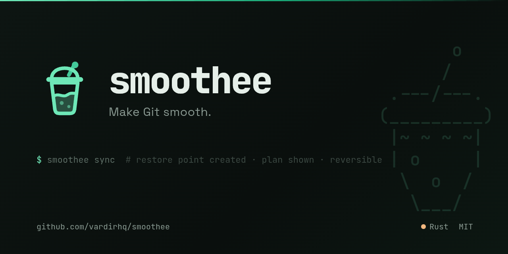

# Smoothee



Make Git smooth.

Smoothee is a safer, clearer command-line workflow for Git and GitHub.

It explains what is happening, creates restore points before risky
operations, guides merge-conflict resolution, and helps you recover
when things go wrong.

Instead of memorizing recovery commands:

```text
         o
        /
   .---/---.     ___                         _     _
  (_________)   / __|  _ __    ___    ___   | |_  | |_    ___   ___
   |~ ~ ~ ~|    \__ \ | '  \  / _ \  / _ \  |  _| | ' \  / -_) / -_)
   | o     |    |___/ |_|_|_| \___/  \___/   \__| |_||_| \___| \___|
    \  o  /
     \___/        make git smooth.
```

    smoothee status
    smoothee sync
    smoothee resolve
    smoothee undo
    smoothee doctor
    smoothee pr

Smoothee uses Git underneath and shows you the commands it runs.
You stay in control.

## Status

Early development. The core safety workflow is taking shape:

```
$ smoothee status

Repository: shop-platform
Branch: feature/login
Base branch: main

Working tree:
  • 3 modified files
  • 1 untracked file

Branch state:
  • 4 commits ahead, 6 commits behind main

Recommended next step:
  Your branch is behind its base and can be updated safely.
  smoothee sync
```

Implemented today:

- `smoothee status` explains repository state and recommends one next step.
- `smoothee sync` fetches the base branch, shows a merge/rebase plan, creates
  a restore point, journals the operation, and stops safely on conflicts.
- `smoothee resolve` walks through in-progress merge/rebase conflicts and
  validates edited files before staging them.
- `smoothee undo` reverses the latest Smoothee-managed operation when a restore
  point is available.
- `smoothee doctor` checks Git, GitHub CLI, repository, base-branch detection,
  and Smoothee configuration.

Still on the roadmap:

- `smoothee pr` for the GitHub pull-request workflow.
- richer commit workflow, history inspection, and AI-assisted explanations.

See [`PROJECT_SUMMARY.md`](PROJECT_SUMMARY.md) for the full design and phased
roadmap.

## What works today

- Repository discovery (honours worktrees, submodules, `GIT_DIR`)
- A structured runner over the installed `git` binary that always keeps
  the real commands inspectable
- Plain-language `status`: working-tree summary, base-branch detection,
  ahead/behind analysis, and a single recommended next step
- Safe synchronization with explicit plans, restore points, operation
  journaling, and conflict-aware stopping
- Guided conflict resolution that refuses to stage files with leftover conflict
  markers
- Reversible operation history through `smoothee undo`
- Read-only diagnostics through `smoothee doctor`
- Per-repository configuration via `.smoothee.toml`
- An append-only operation journal (JSON lines under `.git/smoothee/`) that
  powers undo and future crash recovery

## Brand assets

- [`assets/smoothee-social-preview.png`](assets/smoothee-social-preview.png)
  is the GitHub/social preview image.
- [`assets/smoothee-banner.txt`](assets/smoothee-banner.txt) is the terminal
  banner artwork for CLI output, release notes, or docs.

## Building and testing

Smoothee is a single Rust binary. You need a recent stable Rust
toolchain (1.80+) and a `git` binary on `PATH`.

```sh
cargo build              # debug build → target/debug/smoothee
cargo build --release    # optimized single executable
cargo run -- status      # build and run the status command
cargo run -- doctor      # inspect your Git/GitHub/Smoothee setup
cargo test               # run the full test suite
cargo test <name>        # run a single test by name substring
cargo clippy             # lints
cargo fmt                # format (cargo fmt --check in CI)
```

## Design principles

Smoothee is deliberately conservative:

- **Safe by default** — a restore point is created before any risky operation.
- **Explain before acting** — the plan and reasoning are shown before mutating.
- **Preserve access to Git** — the underlying `git` commands are always visible.
- **Reversible and journaled** — every mutation is recorded so it can be undone.
- **AI suggests, humans approve** — AI never controls the shell or makes
  ambiguous decisions on its own.

## License

MIT — see [`LICENSE`](LICENSE).
